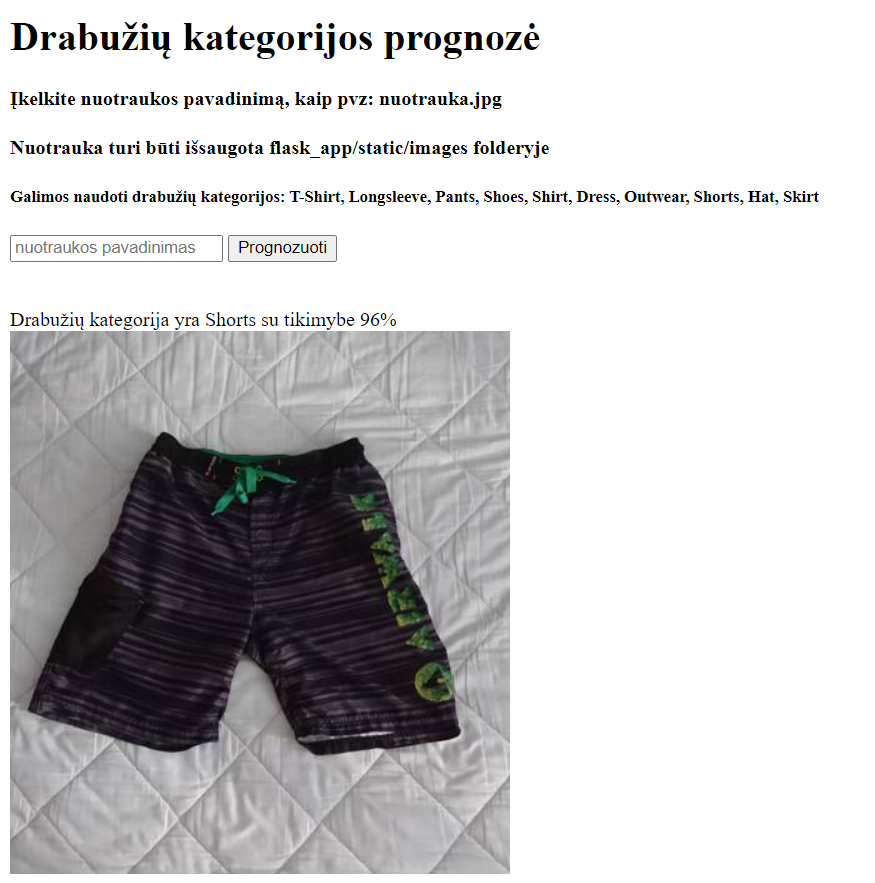

## Projektas drabužiai

5400 nuotraukų su 20 skirtingų kategorijų drabužiais:

 

### Duomenys

`images.csv` failas apima:

* `image` - nuotraukos vardas
* `sender_id` - asmens, prisidėjusio prie nuotraukos gavimo, ID
* `label` - drabužio kategorijos pavadinimas
* `kids` - `True`, jei drabužis yra vaikiškas

### Nuoroda į duomenų rinkinį

* Daugiau informacijos apie duomenis: https://medium.com/data-science-insider/clothing-dataset-5b72cd7c3f1f

### Pasirinktas modelis

Pasirinktas jau ištreniruotas modelis *Mobile Net V3*, nes pačios parašyti
modeliai nedavė tokių gerų rezultatų, kaip ištreniruotas su daugybe
duomenų modelis. Pasirinkta V3, naujausia, Mobile Net modelio versija.
Bandytas ir V2 modelis, bet V3 buvo geresnis.

Atrinkta 10 didžiausių drabužių kategorijų. Testinių duomenų modelio 
tikslumas apie 84%. Su 5 kategorijomis tikslumas buvo beveik 93%,
tai pridėjus daugiau duomenų, modelis prognozuoja 10% blogiau.

#### Modelio metrikos su 10 drabužių kategorijų:

- Duomenys skaidomi į 15 batch'ų, dėl greitesnio modėlio treniravimo
- Learning rate = 0.0005
- Regularizer parametrai: L1=0, L2=0.0001
- Dropout = 0.1
- Paslėptas 1 sluoksnis su 32 stulpeliais

###  Instrukcijos kaip pasileisti API serverį

Flask_app folderyje esantis *app.py* failas paleidžiamas. Atsidaromas tinklalapis, 
esančiame laukelyje įrašomas nuotraukos pavadinimas (pvz.: *nuotrauka.jpg*). Nuotrauka turi būti *flask_app/static/images*
folderyje. Aš patikrinimui naudojau modeliui treniruoti skirtas nuotraukas.

### Rezultatai, išvados

Nuo pradžių kuriami modeliai nėra tokie geri, kaip jau ištreniruoti su dideliais
duomenų rinkiniais modeliai. Tam reikėtų labai galingo kompiuterio ir daug nuotraukų.

Išbandyti keli modeliai, bet geriausias gautas rezultatas buvo pasiektas su Mobile Net V3 modeliu. Su 10 
drabužių kategorijų gautas apie 84% tikslumas prognozuojant drabužio kategoriją.
Su didesniu nuotraukų kiekiu kiekvienoje kategorijoje manau modelio tikslumas 
būtų didesnis. Modelis tikrai yra tobulintinas, bet tam trūksta resursų.
